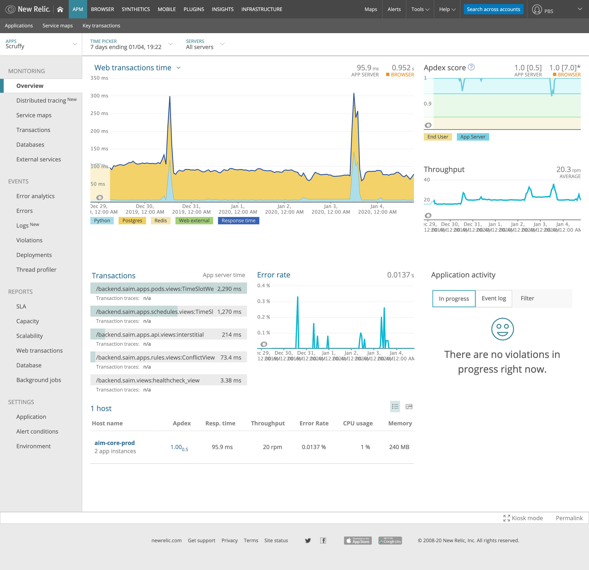
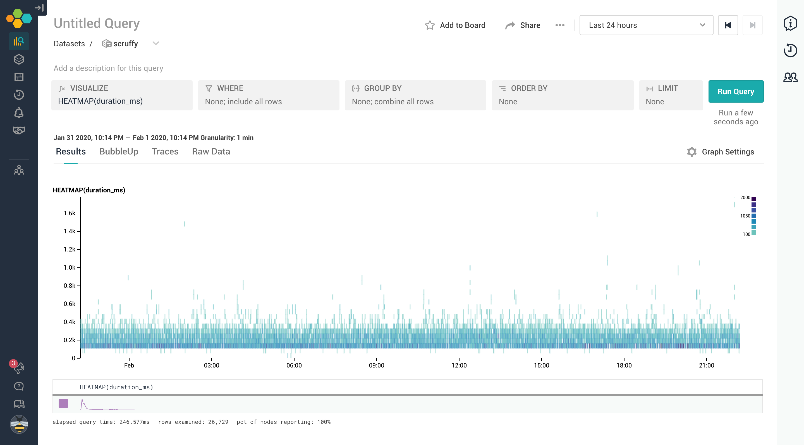
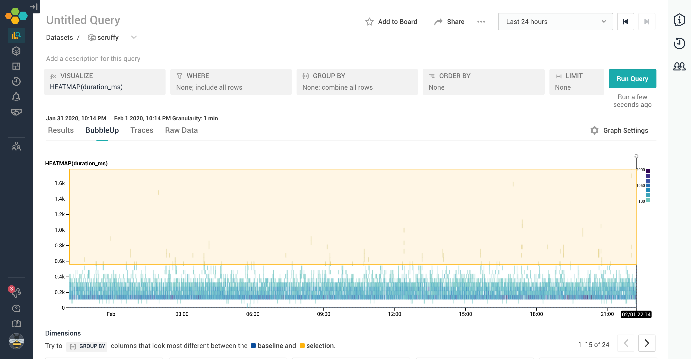
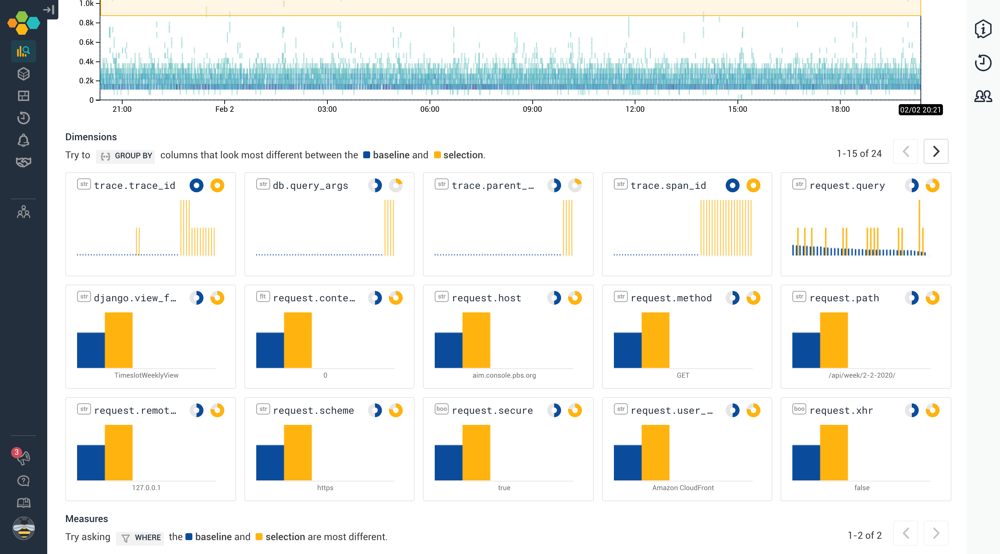
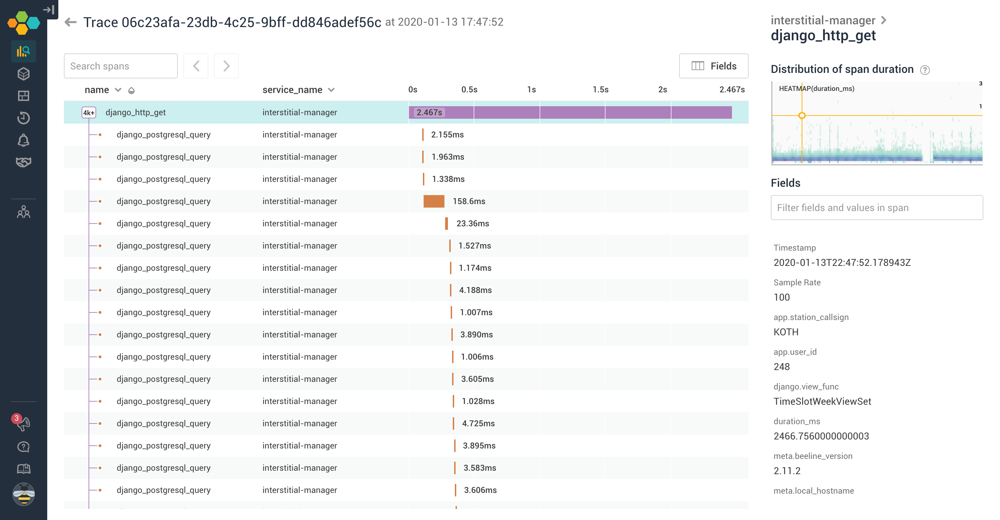

At work I recently inherited a "legacy" application. It was an internal tool
built with [Django](https://www.djangoproject.com/) that helped us schedule and
stitch advertisements into live video feeds for local
[PBS](https://www.pbs.org/) stations. For the rest of this post, I'll refer to
the application as `scruffy`.

Though I wasn't really involved with its original development, `scruffy` was
built right around the same time that, as an engineering organization, we were
exploring and evaluating docker container orchestration. The team that worked
initially on `scruffy` spun up a new [Kubernetes](https://kubernetes.io/) and
ran the application on it. This worked pretty well for the purpose of shipping
an MVP.

Overtime though, we never managed to dedicate enough time to maintain the
Kubernetes cluster properly. And eventually, most other teams settled on
[AWS ECS](https://aws.amazon.com/ecs/) as the de-facto runtime for docker
applications at PBS, which stole even more time and energy away from the K8s
maintinence and upgrades. Deployment became increasingly flaky due to random
issues that would crop up with K8s or Helm, and so development slowed to a crawl
post-MVP. And so here was this little application, a lonely pod running in a
outdated Kubernetes cluster that became neglected over the years.

The reason for the revived interest in `scruffy` is that we realized that live
advertisement scheduling would play an important role on the feature roadmap.
This meant that we would need to actually implement new features instead of just
keeping the application on life-support.

So our small feature team of 2 engineers would help with its migration off of
the legacy Kubernetes cluster onto the better managed AWS ECS cluster. Perhaps
more importantly, we'd also wanted to knock off some obvious bugs and
performance issues along the way. These were fairly significant issues that'd
had been largely ignored because of the difficulty/fear in deploying the
application. This was a classic case of bit rot, and `scruffy` definitely needed
some TLC.

## A new class of observability tools

Whenever I'm adopting an existing project, one of the things I first look for is
existing logging and monitoring tools. At work this usually means familiar tools
like
[AWS Cloudwatch Logs](https://docs.aws.amazon.com/AmazonCloudWatch/latest/logs/WhatIsCloudWatchLogs.html),
[Sentry](https://sentry.io/), and [NewRelic](https://newrelic.com/).

Recently I've been hearing some high praises about a newer generation of
observability tools like [Honeycomb](https://www.honeycomb.io/), which promised
the ability to quickly identify and resolve production issues. According to
their home page:

> With Honeycomb, you not only see production more clearly – you resolve issues
> in a fraction of the time. Teams stay proactive and get ahead of problems as
> new code is shipped and customer impact is minimal. Everyone has the same
> visibility and confidence level because each team-member has access to the
> most granular data – logs, metrics and traces for real-time analysis.

The idea of _granular_ level of real-time logs/metrics/traces would be fantastic
in theory! I wanted to try it out and see just how granular we can get, and
`scruffy` seemed to be a good application to try it out on.

Adding their [Python SDK](https://github.com/honeycombio/beeline-python) was
fairly straightforward. Just had to install their PyPI package and add the
default Django middleware to get started.

```python
# pip install honeycomb-beeline
import beeline

# initialize on application startup
beeline.init(
    writekey='******',
    dataset='scruffy',
    service_name='scruffy',
    debug=True,
)

# add the django middleware
MIDDLEWARE = [
    # ...
    'beeline.middleware.django.HoneyMiddleware',
    # ...
]
```

## Identifying performance problems

One of the recurring problems that the application suffered from was
intermittent `504 Gateway Timeout` errors from the load-balancer. This was a
noticeable error that internal users had long complained about. Out of habit, we
first checked NewRelic for some clues.

### Newrelic



Looking at the overview screen of NewRelic above, here's what's going through my
mind.

- Hmm, there's a couple of spikes, that could be the source of `504`s.
- Looks like the slowest transaction comes from the `TimeslotWeeklyView`. Is
  that where I need to look?
- But the spike doesn't go above ~300ms. And the slowest transaction is ~2200ms.
  Both of which are nowhere near enough the 10000ms+ `504` threshold from the
  load-balancer.
- So what's actually causing the `504`s? Am I on the right track or is this a
  red herring?

While I think NewRelic is fantastic for seeing if there's something obviously
wrong, I always felt that it was unreasonably difficult to extract the
underlying cause of the anomaly or an actionable fix for it. In most cases, I
had to rely on my domain knowledge of the application and intuitions, but I had
neither for `scruffy` given that I've only recently adopted the project.

### Honeycomb

Next we turned to Honeycomb. We'd only been collecting data from the Honeycomb
SDK for a few days, but we were excited to see if it can gives us better
insights.

When I loaded up the application dataset view, the first thing I noticed was
that Honeycomb's "overview" page was fairly sparse. It just gives you this
`SQL`-esque query UI and nothing else. It caught me by surprise a bit,
especially compared to the densely packed NewRelic overview page.

I would later come to appreciate and understand that this is their little nudge
of saying: "Hey, go ahead ask any questions you want about your system. We're
not gonna clutter your view with stuff _we_ think you care about. We'll just
give you the tool to ask any questions that _you_ care about".



One of the first query I ran was the heatmap view of the response duration.
Besides being able to produce an awesome looking plot, the heatmap can provide
an extra dimension to our dataset plot, and it's a great way of quickly showing
outliers.

## Bubble it up

One of the immensely useful feature that synergizes&trade; with the heatmap view
is the BubbleUp tab. It's an UI where you can select a region of your dataset,
and see if/how some of its attributes differ from the baseline.



If we select the durations that are the longest and most anomalous, we can get a
sense of how it compares to the baseline.



With the bubble up view, we can start to get a sense of how these longer
requests are shaped. It seems that they are mostly `GET` requests coming from
the `/api/week/<date>/` path. Which means that `TimeslotWeeklyView` may indeed
be the culprit of the performance problems.

## The magic of tracing

We're honing in and getting closer! The next view I loaded up was the tracing
view, which let's us select a particular request and visualize all the
transaction that took place.



By default, Honeycomb shows you the 10 slowest requests that fall within your
query filters. I load up one of the top offenders, and here's what's going
through my minds as I'm processing the trace results.

- Hmm, there's lots of little spans that seems to happen in waterfall. They seem
  to be Postgres queries. This smells like a
  [N+1](https://secure.phabricator.com/book/phabcontrib/article/n_plus_one/)
  issue.
- Wait at minute, the little number at the base span says `4k+`. Does that mean
  there are more than 4 thousand queries in a single request!? That can't be
  right.
- Did I somehow misconfigure the SDK? Is this a data ingestion/display error on
  Honeycomb's end?

Nope, turns out this was not some sort of mis-reporting issue. We really were
making 4k+ SQL queries per request on the `TimeslotWeeklyView` API endpoints. It
turns out that this was actually a Django Rest Framework anti-pattern that's not
too uncommon.

```python
class FooSerializer(serializers.ModelSerializer):
    title = serializers.CharField()


class BarSerializer(serializers.ModelSerializer):
    # creates N+1 queries by default
    foos = FooSerializer(many=True, read_only=True)


class BazSerializer(serializers.ModelSerializer):
    # creates N+1 queries by default
    bars = BarSerializer(many=True, read_only=True)
```

When you have nested serializers, DRF will be lazy by default, creating distinct
queries in a loop. The fix here is to explicitly tell Django to prefetch related
fields. There's a much better explanation of the problem and the fix
[here](http://ses4j.github.io/2015/11/23/optimizing-slow-django-rest-framework-performance/).

This seemed to be the root cause of `scruffy`'s performance issues on the
`TimeslotWeeklyView`, creating O(N^2) queries, which easily meant thousands of
serial Postgres queries for some users. This can cause the response duration to
balloon to 20+ seconds in certain cases, causing the intermittent `504`s.

In hindsight, this was fairly obvious bug that folks intimate with Django and
DRF's pitfalls may be able to look for. But in `scruffy`'s case, the offending
serializers were spread out over 3 disparate source files, and it's hard to
guess that 3 innocent looking lines of code were to blame unless you knew to
look for N+1 errors.

But ultimately, I think that's the beauty of tracing. It makes misbehaving IOs
in your system apparant. We all build up a model of how our software works
inside our head. And it is at best a simplification of how the software actually
works. At worst, it's just plain wrong. Being able to rely on actual observed
timings of what happens in our software is a game changer!

# Limitation of APMs like NewRelic

As I get more and more used to using the Honeycomb UI, I'm starting to really
appreciate how much of a first class citizen structured events are. You can
attach any meaningful context you want to it, and query/aggregate based on those
context.

And I think that made me aware of what I felt was missing with traditional APMs
like NewRelic. They make it delightfully easy to get started, but at the cost of
imposing their pre-conceived notion of what an "Application" and how it should
be monitored. And they make it difficult to explore outside that boundary.

Want to monitor a GraphQL API? It's difficult because it breaks their
[assumption of what an endpoint is](https://discuss.newrelic.com/t/feature-idea-performance-monitoring-for-nodejs-graphql-application/80710).
Want to monitor Django RQ background workers? They don't have official support
so
[you're largely on your own](https://discuss.newrelic.com/t/reporting-django-web-app-django-rq-worker/5282).
Anytime I've run into this sort of limitation, I either just give up monitoring
it in NewRelic or end up rewriting parts of my application to something that is
officially supported (e.g. migrating from [Django RQ](https://python-rq.org/) to
[Celery](http://www.celeryproject.org/)), which feels backwards to me.

And this is why I think Honeycomb's approach of creating a bunch of toolset
around a core abstraction of events is better:

- Want to observe GraphQL API? Sure, just send a trace span from at each
  resolver.
- Want to observe background jobs? Sure, send a each job as an event.
- Want to observe client side Javascript? Sure, send certain key events as data.
- Want to observe things that aren't applications like
  [CI pipelines](https://github.com/honeycombio/buildevents)? Sure, send each
  build and sub-jobs as events.

It's just a lot more flexible and gives you room to grow. I'm excited to slowly
add more context and see how that might give me more insights.

## Closing thoughts

Within just a week of using Honeycomb, we were able to identify and fix a fairly
significant performance issue. I'm excited to explore more, since I feel like
I'm only begining to scratch the surface of what can be queried and visualized.

One last bit of closing note is that: while I felt like tracing tools like
Honeycomb may be marketed primarily for [microservices](/service-boundaries/), I
still think they are immensely useful for traditional `LAMP`-stack
variants/monoliths. Afterall, whether it's network calls or other forms of IO,
it doesn't change our need to observe and understand the running system.
